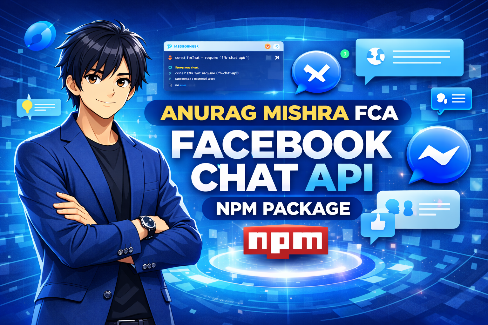

<div align="center">

<!-- Animated Banner -->


<!-- Animated Title -->
<h1>
  
</h1>

<!-- Animated Badges -->
<p>
  
  
  
  
</p>

<!-- Animated Divider -->


</div>

<!-- Animated Introduction -->
<div align="center">

### ✨ **Made with ❤️ by ANURAG MISHRA** ✨

<p align="center">
  
</p>

</div>

---

## 🎯 What's Special About This Fork?

<div align="center">

<table>
<tr>
<td width="50%">

### ❌ Before (Original)
```
🔴 Memory Leaks
🔴 Infinite Reconnect Loops
🔴 CPU Hogging
🔴 Random Crashes
🔴 Resource Waste
```

</td>
<td width="50%">

### ✅ After (This Fork)
```
🟢 Memory Optimized
🟢 Smart Reconnect
🟢 CPU Efficient
🟢 Stable & Reliable
🟢 Production Ready
```

</td>
</tr>
</table>

</div>

---

## 🔧 Bug Fixes & Improvements

| Issue | Status | Description |
|-------|--------|-------------|
| 🐛 Memory Leak | ✅ **FIXED** | Old MQTT clients properly cleaned up |
| 🔄 Hot Reconnect Loop | ✅ **FIXED** | No more infinite loops |
| 💾 Resource Management | ✅ **FIXED** | All resources properly released |
| 🚫 Retry Limits | ✅ **ADDED** | Max 50 reconnects, 10 getSeqID failures |
| ⚠️ Promise Rejections | ✅ **FIXED** | Safe promise handling |
| 🏭 Production Ready | ✅ **YES** | Graceful stop notifications |

---

## 📦 Installation

```bash
# Using npm
npm install fca-anurag-miishraa

# Using yarn
yarn add fca-anurag-miishraa

# Latest version
npm install fca-anurag-miishraa@latest
```

> ⚠️ **Requirements:** Node.js v18.0.0 or higher

---

## 🚀 Quick Start

### 1️⃣ Setup AppState

Create `appstate.json` with your Facebook cookies:

```json
[
  { "key": "c_user", "value": "your-user-id" },
  { "key": "xs", "value": "your-xs-token" },
  { "key": "datr", "value": "your-datr-token" }
]
```

### 2️⃣ Basic Bot

```javascript
const { login } = require("fca-anurag-miishraa");

login({ appState: require("./appstate.json") }, (err, api) => {
  if (err) return console.error("❌ Login failed:", err);
  
  console.log("✅ Bot is running!");
  
  api.listenMqtt((err, message) => {
    if (err) return console.error(err);
    
    if (message.type === "message") {
      console.log(`💬 ${message.senderID}: ${message.body}`);
      
      api.sendMessage(`Echo: ${message.body}`, message.threadID);
    }
  });
});
```

### 3️⃣ Advanced Options

```javascript
const options = {
  selfListen: false,      // Don't listen to own messages
  listenEvents: true,     // Listen to events
  autoReconnect: true,    // Auto-reconnect
  autoMarkRead: true,     // Auto-mark as read
  online: true,           // Show as online
  emitReady: true         // Emit ready event
};

login({ appState: require("./appstate.json") }, options, (err, api) => {
  // Your code here
});
```

---

## 🎨 AI Theme Generation

```javascript
// Create custom AI theme
api.createAITheme({
  threadID: "your-thread-id",
  themePrompt: "ocean sunset with purple gradients",
  callback: (err, result) => {
    if (!err) console.log("🎨 Theme created!", result);
  }
});
```

---

## 📚 API Methods

### 💬 Messaging
- `sendMessage(message, threadID, callback)` - Send messages
- `sendTypingIndicator(threadID, callback)` - Typing indicator
- `markAsRead(threadID, callback)` - Mark as read
- `editMessage(text, messageID, callback)` - Edit messages

### 👥 Thread Management
- `getThreadInfo(threadID, callback)` - Thread info
- `getThreadHistory(threadID, amount, timestamp, callback)` - Message history
- `getThreadList(limit, timestamp, tags, callback)` - Thread list
- `changeThreadColor(color, threadID, callback)` - Change color

### 👤 User Info
- `getUserInfo(ids, callback)` - User information
- `getUserID(name, callback)` - Get user ID
- `getFriendsList(callback)` - Friends list

---

## ⚙️ Configuration Options

| Option | Type | Default | Description |
|--------|------|---------|-------------|
| `selfListen` | boolean | false | Listen to own messages |
| `listenEvents` | boolean | true | Listen to events |
| `autoReconnect` | boolean | true | Auto-reconnect |
| `autoMarkRead` | boolean | true | Auto-mark read |
| `online` | boolean | true | Show as online |
| `emitReady` | boolean | false | Emit ready event |
| `userAgent` | string | default | Custom user agent |
| `proxy` | string | null | Proxy URL |

---

## 🔒 Security Warning

> ⚠️ **IMPORTANT:** `appstate.json` contains sensitive credentials!

- ❌ Never commit to version control
- ❌ Never share publicly
- ✅ Add to `.gitignore`
- ✅ Treat like a password

---

## 🐛 Troubleshooting

<details>
<summary><b>Bot Not Receiving Messages</b></summary>

- ✅ Verify `appstate.json` is valid
- ✅ Check Facebook login in browser
- ✅ Ensure account isn't restricted
</details>

<details>
<summary><b>Login Errors</b></summary>

- 🔄 Re-export cookies
- 🧹 Clear Facebook cookies
- 🌐 Try different browser
</details>

<details>
<summary><b>Connection Issues</b></summary>

- 🔌 Check network connection
- ⏱️ Bot auto-reconnects (max 50 times)
- 🔑 May need fresh session
</details>

---

## 📊 Stats

<div align="center">


</div>

---

## 🙏 Credits

- Original `fca-anurag-miishraa` by **Anurag Miishraa**
- Bug fixes & improvements by **ANURAG MISHRA**
- Inspired by `ws3-fca` community

---

## 🔗 Links

<div align="center">

[](https://github.com/anumishra22/Anurag-Miishraa-FCA-.git)
[](https://www.npmjs.com/package/fca-anurag-miishraa)

</div>

---

<div align="center">

### ⭐ Star this repo if you find it helpful! ⭐


</div>

---

<p align="center">
  
</p>
